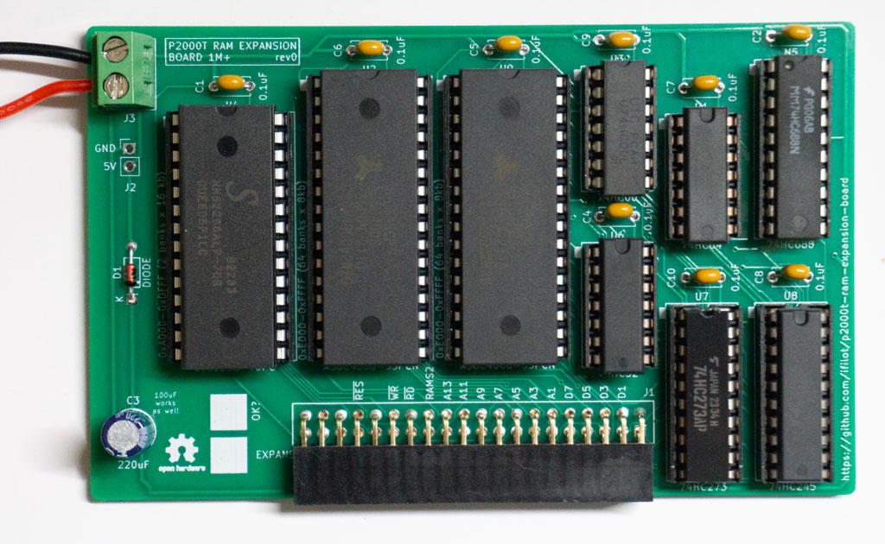
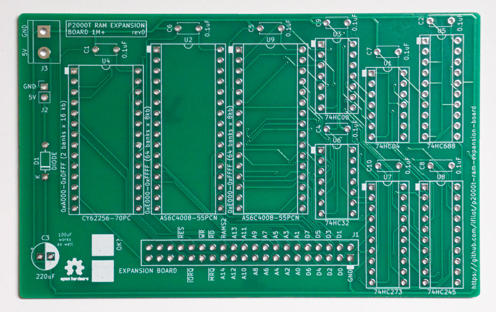

# P2000T RAM expansion board

[](https://github.com/ifilot/p2000t-ram-expansion-board/releases/tag/v0.1.1)
[](https://github.com/ifilot/p2000t-ram-expansion-board/actions/workflows/build.yml)
[](https://www.gnu.org/licenses/gpl-3.0)
[](https://creativecommons.org/licenses/by-nc-sa/4.0/deed.en)

## Purpose

Expand the memory of your P2000T by an additional 64kb, giving in total 80kb
of memory. This board uses modern components which are all still in production.


> [!TIP]
> There is also a 1056kb expansion to have more than a Mb of RAM in your
> P2000T. Scroll down to the bottom of this page for more information.

## Memory lay-out

The memory lay-out of the P2000T is organized as shown in the table below

| Address       | Description    |
| ------------- | -------------- |
| 0x0000-0x1000 | Monitor rom    |
| 0x1000-0x4FFF | Cartridge      |
| 0x5000-0x5FFF | Video memory   |
| 0x6000-0x9FFF | RAM memory     |
| 0xA000-0xDFFF | 16kb expansion |
| 0xE000-0xFFFF | 8kb banks      |

For the default 16kb stock model, only the memory at `0x6000-0x9FFF` is
available. This expansion board adds 64k memory such that an additional 16kb
of RAM is available at `0xA000-0xDFFF` and another 48kb using bank switching.
Bank switching means that you can only access 8kb of the 48kb at a time,
depending on the value of a register which can be accessed via an `OUT`
instruction at `0x94`. This register can hold values of `0-5`, amounting
to 6x8kb = 48kb of bankable memory.

## Installation

To install the expansion board, you need to plug in the expansion board on the
corresponding expansion 2x20 male pin header on the male board. This pin header
is found directly behind the cartridge slots. Furthermore, you need to solder
a GND and a 5V line onto the power PCB (see image below) and insert that in the
screw terminal of the expansion board.

> [!NOTE]  
> Please check carefully that the polarity is correct. Although the board comes
> with reverse polarity protection in the form of a diode, it is always better
> to check twice before turning on the power.

In the image below, you see a GND (black) and a 5V (red) line attached to the
power PCB. Please ensure you solder the lines to the correct pins and check
with a multimeter before connecting to the RAM expansion board.


Consult the image below for the correct voltages between the pins.


> [!WARNING]  
> Please check with a multimeter that you did not short-circuit any of the power
> lines on the POWER PCB. Please check this at least two times before turning on
> your P2000T. Short-circuiting of any of the power rails can cause permanent
> damage your machine.

## Testing the expansion board

This repository comes bundled with a RAM testing utility. Write the RAM testing
utility to a SLOT1 cartridge and boot your P2000T with this program in SLOT1.
The RAM testing utility will perform an extensive test of the memory and show
any errors it encounters.


## Schematic

The schematic for the RAM expansion board is shown below. The ram expansion board
essentially hosts two 32kb RAM chips and a bank register. Using a small set of
additional logic chips, the line decoding and bank switching is handled.


## Bill of materials

* 1x74HC00 (quad NAND-gate)
* 1x74HC04 (hex inverter)
* 1x74HC32 (quad OR-gate)
* 1x74HC157 (quad 2-input multiplexer)
* 1x74HC173 (quad positive edge triggered D-type flip-flop)
* 1x74HC688 (8-bit magnitude comparator)
* 1x74HC245 (octal bus transceiver)
* 2x62256 (32kb SRAM)
* 1x220uF capacitor (100uF also works)
* 8x0.1uF capacitor
* 1x1N4148 diode
* 1x 40 pin female pin header (2x20 pins; 2.54mm spacing)
* 1x screw terminal

**Unpopulated PCB**


**Populated PCB**


## Testing bank switching in BASIC

If you want to test the bank switching functionality in BASIC, you can use
the following instructions after booting the machine.

First, we need to set the top of BASIC to `0x9000`.

```
CLEAR 50,&H9000
```

The reason we do this is to ensure that the stack is not residing at the
top 8kb because those bytes will become inaccessible after bank switching. Next,
we will first write a value to memory address `0xE000`, check that this value
is properly written, change to another bank and read from the same memory address.
A different value should be returned (typically 0). Next, we write a different
value to the `0xE000` and change bank to the initial bank. The original value should 
now be correctly retrieved. The procedure is performed using the following (very small)
snippet of BASIC code.

```
10 POKE &HE000,42
20 PRINT(PEEK(&HE000))
30 OUT &H94,1
40 PRINT(PEEK(&HE000))
50 POKE &HE000,43
60 OUT &H94,0
70 PRINT(PEEK(&HE000))
```
After entering in these instructions, type `RUN`. The output of this code should be
something similar to the code as shown below. The second value might be potentially
different, depending on earlier memory operations, though is expected to be a zero
on a fresh boot of the machine.

```
42
0
42
```

## Files

* [KiCad schematics](pcb/p2000t-ram-expansion-board)
* [RAM tester utility](ramtester)

## 1056kb expansion

Besides the 64kb expansion, this repository also contains a specialty version
of the board to expand your P2000T with 1056kb of memory. This board uses
a single 32kb static RAM chip to provide 2x16kb on `0xA000-0xDFFF` and 
two 512kb static RAM chips to provide another 128x8kb on `0xE000-0xFFFF`. The
way this board works is very similar to the regular 64kb board. The highest
bit in the bank register toggle the 16kb banking while the lower 7 bits provide
the banking for the 8kb of memory.

The source files for this board can be found [here](pcb/p2000t-ram-expansion-board-1056kb/).




## License

* All source code, i.e. the [ram tester utility](ramtester)
  are released under a [GPLv3 license](https://www.gnu.org/licenses/gpl-3.0.html).
* The hardware files (KiCad schematics) are released under the 
  [CC BY-SA 4.0](https://creativecommons.org/licenses/by-sa/4.0/) license.
