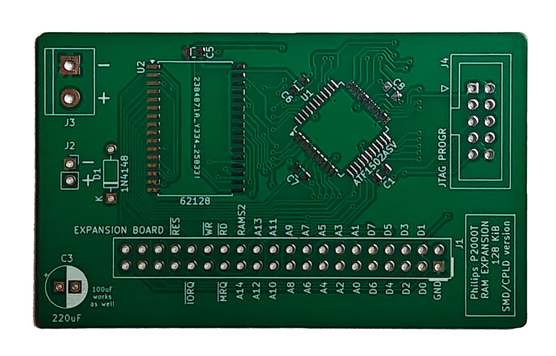
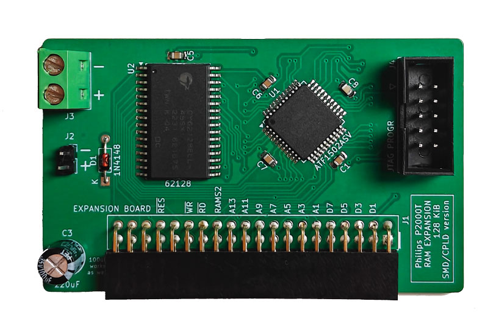
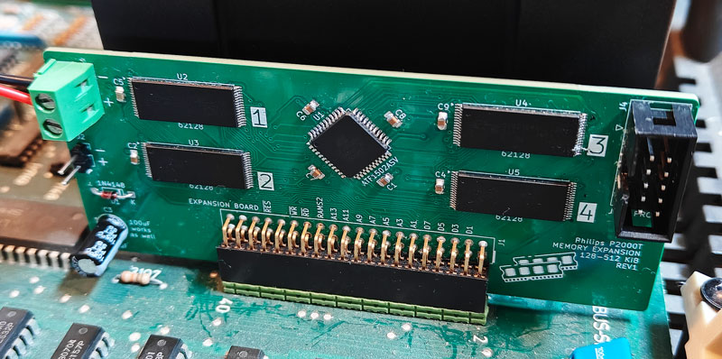

# P2000T RAM expansion board

[](https://github.com/ifilot/p2000t-ram-expansion-board/releases/tag/v0.1.1)
[](https://github.com/ifilot/p2000t-ram-expansion-board/actions/workflows/build.yml)
[](https://www.gnu.org/licenses/gpl-3.0)
[](https://creativecommons.org/licenses/by-nc-sa/4.0/deed.en)
[](https://discord.gg/YtzJTWYAxy)

## Table of contents

* [Purpose](#purpose)
* [Memory lay-out](#memory-lay-out)
* [Installation](#installation)
* [Testing the expansion board](#testing-the-expansion-board)
* [Schematic](#schematic)
* [Bill of materials](#bill-of-materials)
* [Testing bank switching in BASIC](#testing-bank-switching-in-basic)
* [Files](#files)
* [Alternative RAM expansions](#alternative-ram-expansions)
  * [SMD-128KiB version](#smd-128kib-version)
  * [SMD-CPLD-128KiB version](#smd-cpld-128kib-version)
  * [SMD-CPLD-512KiB version](#smd-cpld-512kib-version)
  * [THT-1056 KiB expansion](#tht-1056-kib-expansion)
  * [THT-2080 KiB expansion](#tht-2080-kib-expansion)
* [License](#license)

> [!TIP] 
> Have questions or comments about the **P2000T RAM expansion**? Join
> the conversation and chat with the developers on our [Discord
> server](https://discord.gg/YtzJTWYAxy).

## Purpose

This repository provides several RAM expansion boards for the Philips P2000T,
ranging from 64 KiB to over 2 MiB. Options vary in complexity (THT, SMD, CPLD),
so choose a board that fits your soldering skills and tools. A RAM tester
utility is included to verify proper installation and functionality after
assembly.

> [!IMPORTANT]
> This repository includes various RAM expansion PCBs for the P2000T. Your
> choice should depend on your soldering skills (THT or SMD) and available
> tools (e.g. CPLD programmer). Review this README to find a board that
> matches your comfort level before starting a build. 


## Memory lay-out

The memory lay-out of the P2000T is organized as shown in the table below

| Address       | Description      |
| ------------- | ---------------- |
| 0x0000-0x1000 | Monitor rom      |
| 0x1000-0x4FFF | Cartridge        |
| 0x5000-0x5FFF | Video memory     |
| 0x6000-0x9FFF | RAM memory       |
| 0xA000-0xDFFF | 16 KiB expansion |
| 0xE000-0xFFFF | 8 KiB banks      |

For the default 16 KiB stock model, only the memory at `0x6000-0x9FFF` is
available. The most simple expansion board adds 64k memory such that an
additional 16 KiB of RAM is available at `0xA000-0xDFFF` and another 48 KiB
using bank switching. Bank switching means that you can only access 8 KiB of the
48 KiB at a time, depending on the value of a register which can be accessed via
an `OUT` instruction at `0x94`. This register can hold values of `0-5`,
amounting to 6x8 KiB = 48 KiB of bankable memory.

## Installation

To install the expansion board, you need to plug in the expansion board on the
corresponding expansion 2x20 male pin header on the male board. This pin header
is found directly behind the cartridge slots. Furthermore, you need to solder
a GND and a 5V line onto the power PCB (see image below) and insert that in the
screw terminal of the expansion board.

> [!WARNING]  
> Please check carefully that the polarity is correct. Although the board comes
> with reverse polarity protection in the form of a diode, it is always better
> to check twice before turning on the power.

In the image below, you see a GND (black) and a 5V (red) line attached to the
power PCB. Please ensure you solder the lines to the correct pins and check
with a multimeter before connecting to the RAM expansion board.


Consult the image below for the correct voltages between the pins.


> [!WARNING]  
> Please check with a multimeter that you did not short-circuit any of the power
> lines on the POWER PCB. Please check this at least two times before turning on
> your P2000T. Short-circuiting of any of the power rails can cause permanent
> damage your machine.

## Testing the expansion board

This repository comes bundled with a RAM testing utility. Write the RAM testing
utility to a SLOT1 cartridge and boot your P2000T with this program in SLOT1.
The RAM testing utility will perform an extensive test of the memory and show
any errors it encounters.


## Schematic

The schematic for the RAM expansion board is shown below. The ram expansion
board essentially hosts two 32 KiB RAM chips and a bank register. Using a small
set of additional logic chips, the line decoding and bank switching is handled.


## Bill of materials

* 1x74HC00 (quad NAND-gate)
* 1x74HC04 (hex inverter)
* 1x74HC32 (quad OR-gate)
* 1x74HC157 (quad 2-input multiplexer)
* 1x74HC173 (quad positive edge triggered D-type flip-flop)
* 1x74HC688 (8-bit magnitude comparator)
* 1x74HC245 (octal bus transceiver)
* 2x62256 (32 KiB SRAM)
* 1x220uF capacitor (100uF also works)
* 8x0.1uF capacitor
* 1x1N4148 diode
* 1x 40 pin female pin header (2x20 pins; 2.54mm spacing)
* 1x screw terminal

**Unpopulated PCB**


**Populated PCB**


## Testing bank switching in BASIC

If you want to test the bank switching functionality in BASIC, you can use
the following instructions after booting the machine.

First, we need to set the top of BASIC to `0x9000`.

```
CLEAR 50,&H9000
```

The reason we do this is to ensure that the stack is not residing at the top 8
KiB because those bytes will become inaccessible after bank switching. Next, we
will first write a value to memory address `0xE000`, check that this value is
properly written, change to another bank and read from the same memory address.
A different value should be returned (typically 0). Next, we write a different
value to the `0xE000` and change bank to the initial bank. The original value
should now be correctly retrieved. The procedure is performed using the
following (very small) snippet of BASIC code.

```
10 POKE &HE000,42
20 PRINT(PEEK(&HE000))
30 OUT &H94,1
40 PRINT(PEEK(&HE000))
50 POKE &HE000,43
60 OUT &H94,0
70 PRINT(PEEK(&HE000))
```
After entering in these instructions, type `RUN`. The output of this code should
be something similar to the code as shown below. The second value might be
potentially different, depending on earlier memory operations, though is
expected to be a zero on a fresh boot of the machine.

```
42
0
42
```

## Files

* [KiCad schematics](pcb/p2000t-ram-expansion-board)
* [RAM tester utility](ramtester)

## Alternative RAM expansions

### SMD-128KiB version

Next to the 64 KiB memory expansion using
[DIP](https://en.wikipedia.org/wiki/Dual_in-line_package) chips, there is also a
128 KiB memory expansion using
[SMD](https://en.wikipedia.org/wiki/Surface-mount_technology) chips. Because of
the typical lower price of this last category of chips, this memory expansion is
a bit cheaper to produce. It does require you to be proficient in soldering on
SMD components.

The 128 KiB memory expansion uses a single `CY62128ELL-45SX` 128 KiB memory
chip. The lower 16 KiB of this chip can be accessed at `0xA000-0xDFFF`. The
remaining 112 KiB are available as 14 banks of 8 KiB each at `0xE000-0xFFFF`.
Similar to the other memory expansion boards, bank switching proceeds by writing
a value to I/O port `0x94`. One can also read back the current bank from this
port.

The source files for this board can be found
[here](pcb/p2000t-ram-expansion-board-128kb-smd/).

**Unpopulated PCB**


**Populated PCB**


**Installed PCB**


### SMD-CPLD-128KiB version

To cut down costs even further, there is also a CUPL version. Besides the
`CY62128ELL-45SX`, the PCB only hosts one other chip: a `ATF1502`. All glue
logic required for the RAM expansion board is basically programmed on this chip.

The source files for this board can be found
[here](pcb/p2000t-ram-expansion-board-128-512-smd-cpld).

**Unpopulated PCB**



**Populated PCB**



### SMD-CPLD-512KiB version

Moving beyond the 128 KiB limit, there is also a versatile SMD-type board
that admits 1-4 `CY62128ELL-45SX` 128 KiB memory chips.

The source files for this board can be found
[here](pcb/p2000t-ram-expansion-board-128-512-smd-cpld).

**Installed PCB**



**Populated PCB**


### THT-1056 KiB expansion

This board uses a single 32 KiB static RAM chip to provide 2x16 KiB on
`0xA000-0xDFFF` and two 512 KiB static RAM chips to provide another 128x8 KiB on
`0xE000-0xFFFF`. The way this board works is very similar to the regular 64 KiB
board. The highest bit in the bank register toggle the 16 KiB banking while the
lower 7 bits provide the banking for the 8 KiB of memory.

The source files for this board can be found
[here](pcb/p2000t-ram-expansion-board-1056kb/).

**Unpopulated PCB**


**Populated PCB**


**Installed PCB**


### THT-2080 KiB expansion

This board uses a single 32 KiB static RAM chip to provide 2x16 KiB on
`0xA000-0xDFFF` and four 512 KiB static RAM chips to provide another 256x8 KiB
on `0xE000-0xFFFF`. This board requires two bank registers, one 8-bit bank
register exposed on I/O port `0x94` and another two-bit bank register on I/O
port `0x95` (only one bit of the two-bit bank register is used).

The source files for this board can be found
[here](pcb/p2000t-ram-expansion-board-2080kb/).

**Populated PCB**


**Installed PCB**


## License

* All source code, i.e. the [ram tester utility](ramtester)
  are released under a [GPLv3 license](https://www.gnu.org/licenses/gpl-3.0.html).
* The hardware files (KiCad schematics) are released under the 
  [CC BY-SA 4.0](https://creativecommons.org/licenses/by-sa/4.0/) license.
